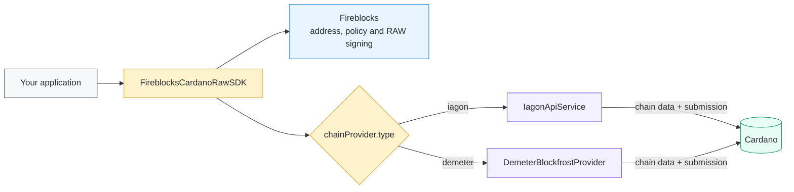

<div align="center">

# Fireblocks Cardano: one SDK, two chain providers

**Keep the Fireblocks Cardano transaction flow. Choose IAGON or Demeter for
Cardano chain access.**

[](https://preview.cardanoscan.io/)
[](#the-wiring-in-one-picture)
[](package.json)
[](examples/confirmed-preview-transaction.json)

[See the SDK fork](https://github.com/verbotenj/cardano-raw-sdk) ·
[Inspect the proof](docs/PROOFS.md) ·
[View the confirmed transaction](https://preview.cardanoscan.io/transaction/becf7855c04240e0f0961f2bf646e22ad4fa0f75fbe45f15ca2af31a77bee800)

</div>

> [!IMPORTANT]
> **The provider switch is the main idea of this POC.** The SDK no longer ties
> its core ADA-transfer path directly to IAGON. Your application supplies one
> `chainProvider` configuration object, and the SDK wires the matching provider
> behind a shared Cardano interface. Existing IAGON integrations remain valid;
> this repository proves the new Demeter route.

## The wiring in one picture



The responsibilities stay separate:

| Component        | Beginner explanation        | What it does here                                                          |
| ---------------- | --------------------------- | -------------------------------------------------------------------------- |
| Your application | Chooses the route           | Passes `type: "iagon"` or `type: "demeter"`                                |
| Fireblocks SDK   | Builds and coordinates      | Builds the Cardano transaction and, in governed mode, requests RAW signing |
| IAGON or Demeter | Connects the SDK to Cardano | Reads balances/UTxOs and submits signed transaction bytes                  |
| Cardano          | Final public record         | Validates the transaction and includes it in a block                       |

Fireblocks does **not** replace a Cardano chain-data provider, and the provider
does **not** receive the Fireblocks private key. The two integrations meet inside
the SDK around the exact transaction bytes that are built, signed, submitted,
and confirmed.

## Switching providers is one configuration choice

The application-facing difference is deliberately small:

```ts
// Keep the original IAGON-backed behavior.
chainProvider: {
  type: "iagon",
  apiKey: process.env.IAGON_API_KEY!,
}
```

```ts
// Select the new Demeter Blockfrost-backed behavior.
chainProvider: {
  type: "demeter",
  baseUrl: process.env.DEMETER_BLOCKFROST_URL!,
  apiKey: process.env.DEMETER_API_KEY!,
}
```

Pass either object as `chainProvider` to
`FireblocksCardanoRawSDK.createInstance(...)`. The old `iagonApiKey` option is
still accepted as a deprecated compatibility path, so existing users are not
forced to migrate immediately.

### Verified directly in the code

This is implemented behavior, not only a diagram:

| Claim                                     | Code evidence                                                                                                                                                                                                                                                              |
| ----------------------------------------- | -------------------------------------------------------------------------------------------------------------------------------------------------------------------------------------------------------------------------------------------------------------------------- |
| Both providers share one core contract    | [`CardanoDataProvider`](https://github.com/verbotenj/cardano-raw-sdk/blob/92654549c7efda7ff21567b2eeffd36e535996eb/src/types/providers.ts) defines health, balance, UTxO, slot, submission, and confirmation operations.                                           |
| Configuration accepts either provider     | [`ChainProviderConfig`](https://github.com/verbotenj/cardano-raw-sdk/blob/92654549c7efda7ff21567b2eeffd36e535996eb/src/types/providers.ts) is an `iagon`/`demeter` TypeScript union.                                                                               |
| The SDK performs the wiring               | [`createInstance()`](https://github.com/verbotenj/cardano-raw-sdk/blob/92654549c7efda7ff21567b2eeffd36e535996eb/src/FireblocksCardanoRawSDK.ts) selects `IagonApiService` or `DemeterBlockfrostProvider`.                                                        |
| IAGON remains supported                   | [`IagonApiService`](https://github.com/verbotenj/cardano-raw-sdk/blob/92654549c7efda7ff21567b2eeffd36e535996eb/src/services/iagon.api.service.ts) implements the shared contract and retains the extended SDK feature set.                                        |
| Demeter is a real provider implementation | [`DemeterBlockfrostProvider`](https://github.com/verbotenj/cardano-raw-sdk/blob/92654549c7efda7ff21567b2eeffd36e535996eb/src/services/demeter-blockfrost.provider.ts) implements the contract, validates the resource URL, and authenticates with `dmtr-api-key`. |
| This POC exercises the Demeter branch     | [`createProvider()`](src/index.ts) constructs Demeter for the local flow, while the [Fireblocks flow](src/index.ts) passes the Demeter configuration through `createInstance()`.                                                                       |

IAGON implements the SDK's broad, existing feature surface. Initial Demeter
support intentionally targets the complete ADA-transfer path: health, network
identity, balance, UTxOs, current slot, signed-CBOR submission, and transaction
confirmation. Calls that still require an IAGON-only capability fail clearly
instead of silently using the wrong backend. The detailed boundary is listed in
the [Demeter compatibility audit](docs/DEMETER_README_COMPATIBILITY.md).

## What this POC proves

| Proof layer        | What you can verify                                                                                                                                                                                                                                                                                                                                                                                                          |
| ------------------ | ---------------------------------------------------------------------------------------------------------------------------------------------------------------------------------------------------------------------------------------------------------------------------------------------------------------------------------------------------------------------------------------------------------------------------- |
| Source             | The dependency is pinned to the [Demeter-enabled SDK revision](https://github.com/verbotenj/cardano-raw-sdk/commit/92654549c7efda7ff21567b2eeffd36e535996eb).                                                                                                                                                                                                                                                                |
| Contract tests     | Provider tests cover normalized IAGON and Demeter behavior, including binary CBOR submission. The local [on-chain proof tests](src/on-chain-proof.test.ts) reject seven kinds of altered or unsafe evidence.                                                                                                                                                                                                                 |
| Live Demeter reads | `npm run proof:demeter` checks Preview health, network, balance, UTxOs, slot, and an already-confirmed transaction. It does not broadcast.                                                                                                                                                                                                                                                                                   |
| On-chain result    | The saved [receipt](examples/confirmed-preview-transaction.json), [execution log](examples/confirmed-preview-run.txt), [fresh chain-verification report](examples/on-chain-verification.json), and [Cardano explorer record](https://preview.cardanoscan.io/transaction/becf7855c04240e0f0961f2bf646e22ad4fa0f75fbe45f15ca2af31a77bee800) correlate the SDK-built transaction, Demeter submission, and Cardano confirmation. |

The chain itself records transaction bytes and settlement—not the name of the
SDK or gateway. That provenance is demonstrated by the pinned SDK source, the
provider-specific request code, the sanitized execution log, Demeter's returned
hash, and Cardano confirming the same hash.

The default `mock` mode **never submits or broadcasts**. It reads Preview through
Demeter, builds a 2 ADA transaction, and verifies a local test signature. The
explicitly gated local mode submits those signed bytes and returns a real Preview
transaction hash. Neither mode needs Fireblocks credentials; the separate
governed mode demonstrates Fireblocks RAW signing.

## A five-minute Cardano mental model

- **ADA** is Cardano's native currency. **Lovelace** is its smallest unit:
  `1 ADA = 1,000,000 lovelace`.
- **Preview** is a public Cardano test network. Preview ADA has no real-world
  value and can be requested from the testnet faucet.
- A **UTxO** is an unspent output from an earlier transaction. A transaction
  consumes complete UTxOs and creates new UTxOs for the recipient and usually
  for change back to the sender.
- A **witness** proves that the payment key authorized a transaction. The mock
  runner creates and verifies one locally.
- A **chain provider** gives the SDK access to current blockchain data and lets
  supported flows submit transactions. Here, that provider is Demeter.

The data flow is:

```text
your test wallet -> this POC -> build + sign locally
                                      |
             mock stops here <--------+--------> Demeter -> Cardano Preview
```

## Why Fireblocks governance changes the POC

For an individual test wallet, one person can decide, sign, and submit. A company
usually needs those responsibilities separated. The governed mode turns a Cardano
transfer into a traceable chain of decisions:

```text
business intent
    -> SDK validates recipient, amount, network, fee, inputs, outputs, and change
    -> Fireblocks TAP approval groups authorize the exact transaction-body hash
    -> a designated Fireblocks signer signs that hash
    -> the SDK verifies the signature and proves the body did not change
    -> Demeter submits the signed CBOR
    -> Cardano confirms the same hash on Preview
```

That is interesting to Fireblocks users because it connects institutional custody
controls to a chain that is not handled by a native one-call transfer in this
integration. Fireblocks remains the authority for **who may approve and sign**;
Demeter is limited to **reading and submitting Cardano data**; Cardano supplies the
public settlement record. The application and Demeter never receive the private
key.

Treasury teams, custodians, exchanges, fintech developers, auditors, and compliance
teams benefit from the resulting correlation record. A single receipt links the
unique business operation ID, Fireblocks transaction ID, approval/signing quorum,
Cardano transaction-body hash, Demeter submission hash, and confirmed Cardano hash.
This is Fireblocks **transaction governance**, not Cardano protocol governance such
as DRep voting.

The repository includes the complete advanced walkthrough in
[`docs/FIREBLOCKS_GOVERNANCE.md`](docs/FIREBLOCKS_GOVERNANCE.md). It also contains a
clearly labeled simulated receipt so a beginner can inspect and validate the proof
shape without Fireblocks credentials:

```bash
npm run proof:verify
```

The walkthrough now presents the governed flow as nine beginner-friendly proof
checkpoints. That matters because custody is only half the problem: Fireblocks can
protect the key, but operators still need confidence that the key signed the
intended Cardano payment and that Demeter submitted those same bytes. The receipt
connects those responsibilities without giving either system more authority than
it needs.

## What Demeter provides

[Demeter](https://demeter.run/) hosts Cardano infrastructure so this example
does not need a local Cardano node or indexer. Its Blockfrost service exposes the
familiar Blockfrost REST endpoints used for addresses, UTxOs, blocks, and
transactions.

One detail matters when comparing examples from the internet: regular
Blockfrost projects normally use a `project_id` request header, while Demeter
authenticates this resource with `dmtr-api-key`. The SDK provider handles that
header for you; put the key only in `.env.development`.

## Prerequisites

- Node.js 20 or newer (`node --version`)
- npm
- A Demeter account with a Blockfrost resource for **Cardano Preview**
- Two Preview addresses beginning with `addr_test1`
- The recovery phrase for the first address's **disposable Preview test wallet**
- Enough test ADA at the first address for 2 ADA plus a fee

Never use a mainnet wallet, recovery phrase, address, or real ADA in this
tutorial.

## 1. Create the Demeter connection

1. Sign in to [Demeter](https://demeter.run/).
2. Create or select a project.
3. Add a Blockfrost resource/port and select the Cardano **Preview** network.
4. Copy the resource's base URL and API key. Keep the key private.

The expected Preview URL currently looks like:

```text
https://cardano-preview.blockfrost-m1.demeter.run
```

Use the values shown by your own Demeter project if they differ.

## 2. Install and configure the POC

Clone the example, then install it:

```bash
git clone https://github.com/verbotenj/cardano-raw-sdk-demeter-poc.git
cd cardano-raw-sdk-demeter-poc
npm install
cp .env.example .env.development
```

Open `.env.development` and set these values:

| Variable                 | Beginner value                | Purpose                                     |
| ------------------------ | ----------------------------- | ------------------------------------------- |
| `CARDANO_NETWORK`        | `Preview`                     | Prevents the tutorial from using mainnet    |
| `CUSTODY_MODE`           | `mock`                        | Builds and signs locally but never submits  |
| `DEMETER_BLOCKFROST_URL` | Your Preview resource URL     | Demeter API endpoint                        |
| `DEMETER_API_KEY`        | Your private key              | Authenticates requests to Demeter           |
| `CARDANO_MNEMONIC`       | Disposable test-wallet phrase | Derives the local payment key               |
| `CARDANO_ADDRESS_1`      | Funded source `addr_test1...` | Supplies the UTxOs                          |
| `CARDANO_ADDRESS_2`      | Different `addr_test1...`     | Receives the example output                 |
| `LIVE_TRANSFER_LOVELACE` | `2000000`                     | Builds a 2 ADA transfer                     |
| `RUN_LIVE_LOCAL`         | `0`                           | Explicit gate for local on-chain submission |

Leave every `FIREBLOCKS_*` value empty and keep `RUN_LIVE_FIREBLOCKS=0` for the
beginner flow.

For the governed Fireblocks flow, configure the workspace policy and advanced
variables described in
[`docs/FIREBLOCKS_GOVERNANCE.md`](docs/FIREBLOCKS_GOVERNANCE.md). The live command
is deliberately unavailable until `RUN_LIVE_FIREBLOCKS=1` is set.

If the source address needs test ADA, use the
[official Cardano testnet faucet](https://docs.cardano.org/cardano-testnets/tools/faucet/)
and select Preview. Faucet funds have no real value, but recovery phrases and
API keys should still be treated as secrets.

## 3. Check and run

First, verify that TypeScript compiles:

```bash
npm run check
```

Then run the guided mock transfer:

```bash
npm run demo
```

`npm run poc:mock` is an equivalent, more explicit command.

To run the complete safe proof against the claims in the original Fireblocks
README, use:

```bash
npm run proof:demeter
```

This type-checks the POC, verifies its tests, builds and signs a mock transaction,
then checks live Demeter health, balances, UTxOs, the latest slot, and the saved
confirmed transaction. It finishes by independently comparing the committed
receipt with fresh Demeter transaction data. It never broadcasts a new
transaction. The exact scope and unsupported features are documented in
[`docs/DEMETER_README_COMPATIBILITY.md`](docs/DEMETER_README_COMPATIBILITY.md).

To verify only the existing on-chain result—without a mnemonic,
transaction build, or broadcast—run:

```bash
npm run proof:chain
```

This read-only check requires the Demeter URL/API key and the original source and
recipient addresses in `CARDANO_ADDRESS_1` and `CARDANO_ADDRESS_2`. It verifies the
Preview network magic, fetches the committed transaction, matches its hash,
block, slot, time, fee, and byte size to the receipt, and writes sanitized JSON
and text logs under `output/proofs/`. It also reads actual transaction inputs and
outputs, verifies the recipient's 2 ADA, source change, ADA/token conservation,
block confirmation depth, and unchanged inclusion on a second lookup. These are
point-in-time observations from Demeter, not an independent node consensus check
or proof of permanent finality.

For one QA-style acceptance log per implemented action, run `npm run proof:qa`.
The sanitized files in [`proofs/qa-compatibility/`](proofs/qa-compatibility/) record
Preview readiness, the confirmed payment, and current-parameter construction.
They include timestamps, expected/actual results, executable SDK hashes and zero
submission attempts. They document executed checks, not full feature parity.

To verify the newer history, asset, stake-account/reward and individual pool
reads, run `npm run proof:qa:indexed`. The [beginner indexed-read guide](docs/INDEXED_READS.md)
explains the API and limitations; [one QA record per action](proofs/qa-indexed-reads/)
records the live Preview results. These are read operations, not staking or
governance transaction support.

The runner prints six stages followed by a summary similar to:

```json
{
  "network": "preview",
  "balanceAda": "10 ADA",
  "balanceLovelace": 10000000,
  "selectedUtxos": 1,
  "transferAda": "2 ADA",
  "transferLovelace": 2000000,
  "feeAda": "0.17 ADA",
  "feeLovelace": 170000,
  "witnessVerified": true,
  "submitted": false,
  "confirmed": false
}
```

Your balance, selected UTxO count, and exact fee will differ. The two results to
look for are `witnessVerified: true` and `submitted: false`.

## 4. Submit the transfer on-chain

After the mock succeeds, the same locally derived Preview payment key can sign
and submit the transaction without Fireblocks. This command spends 2 Preview
test ADA from `CARDANO_ADDRESS_1`, sends it to `CARDANO_ADDRESS_2`, and pays a
Preview network fee:

```bash
RUN_LIVE_LOCAL=1 npm run poc:local
```

`RUN_LIVE_LOCAL=1` is the explicit broadcast gate. The command prints the
transaction hash as soon as Demeter accepts the signed CBOR, provides a Cardano
Preview explorer URL, and polls Demeter until the transaction is confirmed.

A successful result ends with values like:

```json
{
  "witnessVerified": true,
  "submitted": true,
  "confirmed": true,
  "transactionHash": "...",
  "explorerUrl": "https://preview.cardanoscan.io/transaction/..."
}
```

Every execution also writes a timestamped structured log under `output/runs/`.
A confirmed local transfer writes a separate receipt under
`output/transactions/<transaction-hash>.json`. The receipt contains the amount,
fee, CBOR byte size, block, slot, confirmation time, and explorer URL. It omits
wallet addresses, credentials, the recovery phrase, and signed CBOR.

This repository includes the sanitized evidence from its first confirmed run:

- [Confirmed transaction receipt](examples/confirmed-preview-transaction.json)
- [On-chain execution log](examples/confirmed-preview-run.txt)
- [Fresh read-only on-chain verification](examples/on-chain-verification.json)
- [Read-only verification log](examples/on-chain-verification.txt)
- [Live Demeter README proof report](examples/demeter-readme-compatibility-proof.json)
- [Proof chain: Cardano Raw SDK, Demeter, and on-chain evidence](docs/PROOFS.md)
- [Original README compatibility audit](docs/DEMETER_README_COMPATIBILITY.md)

On-chain transactions cannot be undone. Although Preview ADA has no real-world
value, always verify `CARDANO_ADDRESS_2` and the amount before running this
command.

## Where to look in the code

The complete walkthrough is intentionally kept in
[`src/index.ts`](src/index.ts):

- `createProvider()` configures Demeter.
- `fetchAndSelectUtxosForAda()` reads and selects spendable UTxOs.
- `buildAdaTransactionWithCalculatedFee()` creates the transaction body.
- `derivePaymentKey()` follows the Cardano CIP-1852 payment-key path.
- `assertPaymentKeyMatchesAddress()` prevents signing with the wrong phrase.
- `runLocal(false)` performs the safe six-stage mock tutorial.
- `runLocal(true)` assembles, submits, and confirms the local-custody transfer.
- `runFireblocks()` is the separately gated advanced path.
- `verifyGovernanceReceipt()` checks the cross-system hashes and control results
  in a saved receipt.
- `logEvent()` creates timestamped structured execution events.
- `saveJsonArtifact()` writes local run logs and transaction receipts.

For the provider implementation itself, see
[`DemeterBlockfrostProvider`](https://github.com/verbotenj/cardano-raw-sdk/blob/main/src/services/demeter-blockfrost.provider.ts)
in the SDK fork.

## Troubleshooting

### `DEMETER_API_KEY is missing`

Copy `.env.example` to `.env.development` and add the key from your Demeter
resource. Do not add it to `.env.example`.

### Demeter health check failed or HTTP 401/403

Confirm that the URL and key belong to the same active Demeter resource. Set
`POC_VERBOSE=1` temporarily for SDK request diagnostics; secrets remain
sanitized.

### Address not found, no UTxOs, or insufficient funds

Confirm both addresses are Preview addresses and fund `CARDANO_ADDRESS_1` from
the Preview faucet. A displayed wallet balance may consist of UTxOs that have
not appeared in the provider yet; wait briefly and retry.

### `CARDANO_MNEMONIC does not derive CARDANO_ADDRESS_1`

The phrase and source address are from different wallets/accounts, or the wallet
uses a different derivation path. Do not work around this check.

### Mock mode is restricted to Preview

Restore `CARDANO_NETWORK=Preview`. This is a deliberate safety boundary.

### Set `RUN_LIVE_LOCAL=1` to authorize broadcasting

The on-chain command is intentionally blocked without an explicit live flag.
Run `RUN_LIVE_LOCAL=1 npm run poc:local` after verifying the recipient and
amount.

For additional SDK logs:

```bash
POC_VERBOSE=1 npm run demo
```

## Advanced: real Fireblocks custody

The repository retains the original Fireblocks path for developers who already
have a configured Fireblocks Cardano vault. It gets the source address from the
vault, requests raw signing, submits the signed transaction through Demeter, and
polls for confirmation.

This path can move test funds and is not part of the beginner tutorial. It runs
only when all Fireblocks settings are present and
`RUN_LIVE_FIREBLOCKS=1` is explicitly set:

```bash
npm run poc:fireblocks
```

It remains restricted to Preview and a transfer amount between 1 and 5 ADA.

## Security notes

- `.env.development` is ignored by Git; confirm with
  `git check-ignore .env.development`.
- Never paste a recovery phrase, API key, or PEM key into source code, an issue,
  a pull request, or terminal output shared with others.
- Rotate a Demeter key immediately if it is exposed.
- Use a disposable Preview wallet containing only test ADA.
- The runner never prints the mnemonic, API key, PEM content, or signed
  transaction CBOR.
- Generated `output/` artifacts are ignored by Git. Review and sanitize any log
  before deliberately sharing it.

## Learn more

- [Cardano's EUTxO model](https://docs.cardano.org/about-cardano/learn/eutxo-explainer/)
- [Cardano Preview and Pre-production environments](https://docs.cardano.org/cardano-testnets/environments/)
- [Blockfrost API documentation](https://docs.blockfrost.io/)
- [Demeter documentation](https://docs.demeter.run/)
